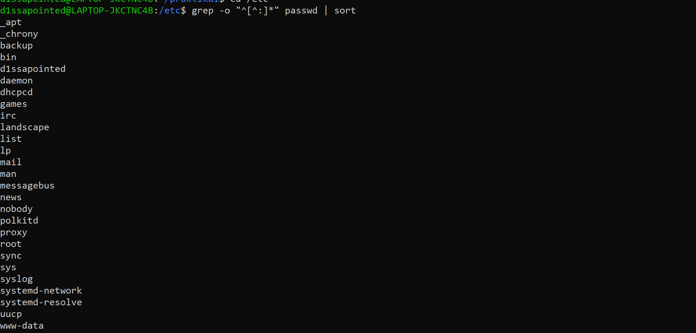
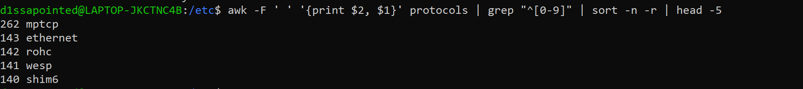
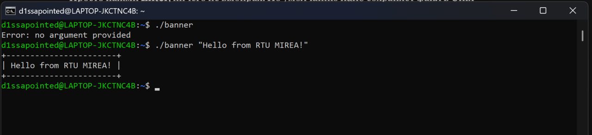
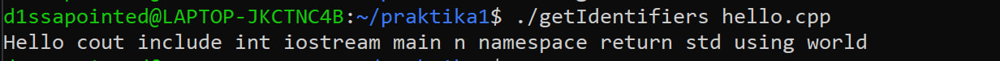
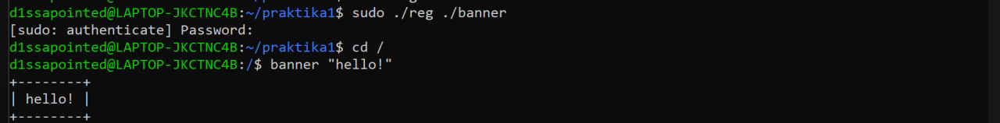
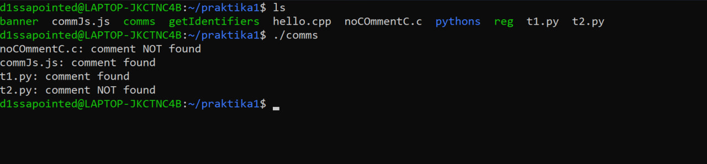
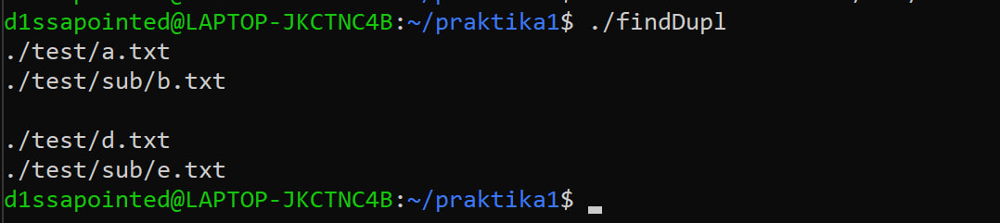
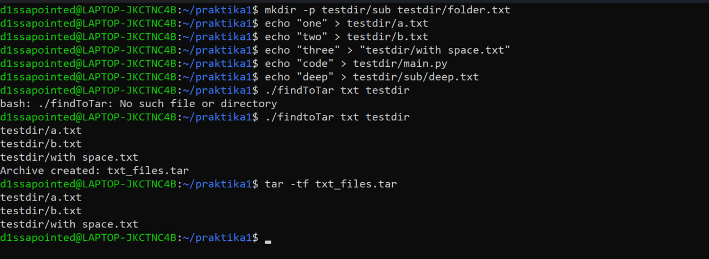
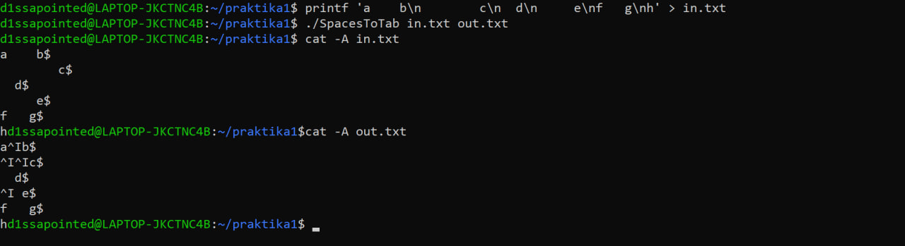
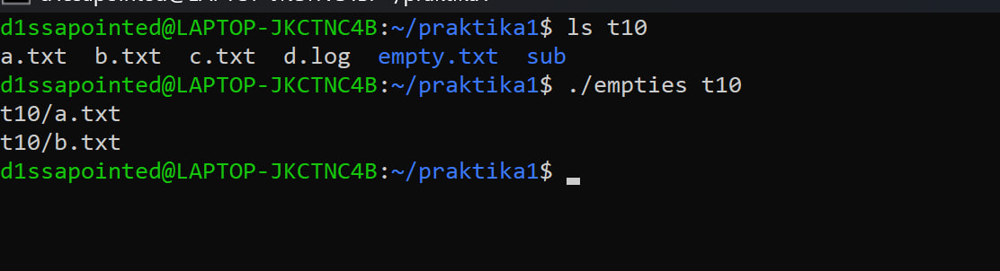

# Решения задач по bash

## Общие шпаргалки

- `#!/bin/bash` — шебанг, первая строка скрипта: чем его исполнять.
- `chmod +x файл` — сделать скрипт исполняемым.
- `$1`, `$2` — аргументы; `$#` — их количество; `$0` — имя скрипта.
- `"$var"` — переменные **всегда** в двойных кавычках.
- `[ ... ]` — проверка условия/
- `-eq`, `-lt`, `-gt` — сравнение чисел; `=` — сравнение строк.
- `-f` — существует файл; `-d` — существует папка; `-z` — строка пустая; `!` — отрицание.
- `>&2` — вывод в поток ошибок; `exit 1` — выход с ошибкой.
- `|` — конвейер: вывод одной команды идёт на вход следующей.
- `$(команда)` — подставить вывод команды.

---

## Задача 1

> Вывести отсортированный в алфавитном порядке список имен пользователей в файле passwd (вам понадобится grep).

```bash
grep -o "^[^:]*" /etc/passwd | sort
```

**Пример:**



- `-o` — выводить только совпавшую часть, а не всю строку.
- `^` — начало строки.
- `[^:]*` — любые символы, кроме `:`, сколько угодно раз (имя стоит до первого двоеточия).
- `sort` — сортировка по алфавиту.

---

## Задача 2

> Вывести 5 протоколов с наибольшими номерами из файла protocols.

```bash
awk -F ' ' '{print $2, $1}' /etc/protocols | grep "^[0-9]" | sort -n -r | head -5
```

**Пример:**



- `awk -F ' '` — разбить строки на поля по пробелу.
- `{print $2, $1}` — вывести 2-е поле (номер), затем 1-е (имя).
- `grep "^[0-9]"` — оставить строки, начинающиеся с цифры (отсекает комментарии).
- `sort -n` — числовая сортировка; `-r` — в обратном порядке.
- `head -5` — первые 5 строк.

---

## Задача 3

> Написать программу banner средствами bash для вывода текстов в рамке (размер баннера должен меняться).

```bash
#!/bin/bash

if [ "$#" -eq 0 ]; then
    echo "Error: no argument provided" >&2
    exit 1
fi
text="$1"
len=${#text}
n=$((len+2))
printf '+'
for ((i = 0; i < n; i++)); do
    printf '%s' "-"
done
printf '+\n'
printf '| %s |\n' "$text"
printf '+'
for ((i = 0; i < n; i++)); do
    printf '%s' "-"
done
printf '+\n'
```

**Пример:**



- `${#text}` — длина строки.
- `$(( ... ))` — арифметика; `+2` — это пробелы по бокам текста.
- `for ((...))` — цикл со счётчиком, как в C.
- `printf '%s'` — печать без перевода строки; `\n` — перевод строки.

---

## Задача 4

> Написать программу для вывода всех идентификаторов (по правилам C/C++ или Java) в файле (без повторений).

```bash
#!/bin/bash

if [ ! -f "$1" ]; then
    echo 'Error: file not found' >&2
    exit 1
fi

grep -o "[a-zA-Z_][a-zA-Z0-9_]*" "$1" | sort -u | tr '\n' ' '
echo
```

**Пример** (`hello.cpp` — простая программа Hello, world на C++):



- `[a-zA-Z_]` — первый символ: буква или `_`; `[a-zA-Z0-9_]*` — дальше ещё и цифры.
- `sort -u` — сортировка с удалением повторов.
- `tr '\n' ' '` — посимвольная замена: переводы строк на пробелы.
- `echo` в конце — просто перевод строки.

---

## Задача 5

> Написать программу для регистрации пользовательской команды (правильные права доступа и копирование в /usr/local/bin).

```bash
#!/bin/bash

if [ ! -f "$1" ]; then
    echo "Error: file not found" >&2
    exit 1
fi
filename="$(basename "$1")"
cp "$1" "/usr/local/bin"
chmod 755 "/usr/local/bin/$filename"
```

Запуск: `sudo ./reg banner`

**Пример:**



- `/usr/local/bin` — папка из `PATH`, команды оттуда запускаются из любого места.
- `basename` — имя файла без пути (`./dir/banner` → `banner`).
- `chmod 755` = `rwxr-xr-x`: r=4, w=2, x=1; цифры — владелец, группа, остальные.
- `sudo` — нужен, чтобы писать в системную папку.

---

## Задача 6

> Написать программу для проверки наличия комментария в первой строке файлов с расширением c, js и py.

```bash
#!/bin/bash

path=""
if [ "$#" -eq 0 ]; then
    path="."
else
    path="$1"
fi

if [ ! -d "$path" ]; then
    echo "Error: directory not found" >&2
    exit 1
fi

for file in "$path"/*.c "$path"/*.js "$path"/*.py; do
    [ -f "$file" ] || continue
    ext="${file##*.}"
    first=$(head -n 1 "$file")
    case "$ext" in
        py)
            if echo "$first" | grep -q "^#"; then
                printf '%s: comment found\n' "$(basename "$file")"
            else
                printf '%s: comment NOT found\n' "$(basename "$file")"
            fi
            ;;
        c|js)
            if echo "$first" | grep -q -E "^(//|/\*)"; then
                printf '%s: comment found\n' "$(basename "$file")"
            else
                printf '%s: comment NOT found\n' "$(basename "$file")"
            fi
            ;;
    esac
done
```

**Пример** (в папке `noCOmmentC.c` без комментария, `commJs.js` с комментарием, `t1.py` с комментарием, `t2.py` без):



- `"$path"/*.c` — шаблон файлов; звёздочка вне кавычек, иначе не раскроется.
- `[ -f "$file" ] || continue` — пропустить, если файлов по шаблону нет.
- `${file##*.}` — отрезать всё до последней точки → расширение.
- `head -n 1` — первая строка файла.
- `case ... esac` — выбор по значению; `|` — «или»; `;;` — конец ветки.
- `grep -q` — молча, только код возврата для `if`; `-E` — расширенные регулярки.
- `\*` — экранированная звёздочка (буквальный символ `*`).

---

## Задача 7

> Написать программу для нахождения файлов-дубликатов (имеющих 1 или более копий содержимого) по заданному пути (и подкаталогам).

```bash
#!/bin/bash

path=""
if [ "$#" -eq 0 ]; then
    path="."
else
    path="$1"
fi

if [ ! -d "$path" ]; then
    echo "Error: directory not found" >&2
    exit 1
fi

find "$path" -type f -exec md5sum {} + | sort | uniq -w 32 --all-repeated=separate | cut -c 35-
```



- `find` — рекурсивный поиск; `-type f` — только файлы.
- `-exec md5sum {} +` — посчитать хеш; `{}` заменяется на найденные файлы.
- `md5sum` — хеш содержимого (32 символа); одинаковое содержимое → одинаковый хеш.
- `sort` — ставит одинаковые хеши рядом.
- `uniq -w 32` — сравнивать только первые 32 символа (хеш).
- `--all-repeated=separate` — только повторы, группы через пустую строку.
- `cut -c 35-` — убрать хеш и два пробела, оставить путь.

---

## Задача 8

> Написать программу, которая находит все файлы в данном каталоге с расширением, указанным в качестве аргумента, и архивирует все эти файлы в архив tar.

```bash
#!/bin/bash

# проверка аргументов: 1 или 2
if [ "$#" -lt 1 ] || [ "$#" -gt 2 ]; then
    echo "Usage: $0 extension [directory]" >&2
    exit 1
fi

ext="${1#.}"
dir=""
if [ "$#" -lt 2 ]; then
    dir="."
else
    dir="$2"
fi

if [ -z "$ext" ]; then
    echo "Error: extension is empty" >&2
    exit 1
fi

if [ ! -d "$dir" ]; then
    echo "Error: directory not found: $dir" >&2
    exit 1
fi

archive="${ext}_files.tar"

if [ -z "$(find "$dir" -maxdepth 1 -type f -name "*.$ext" -print -quit)" ]; then
    echo "No .$ext files found in $dir" >&2
    exit 1
fi

find "$dir" -maxdepth 1 -type f -name "*.$ext" -print0 | tar -cvf "$archive" --null -T -
echo "Archive created: $archive"
```

Запуск: `./findtoTar txt testdir` · проверка архива: `tar -tf txt_files.tar`

**Пример:**



В архив не попали `main.py` (другое расширение), `sub/deep.txt` (подпапка) и `folder.txt` (это папка).

- `||` — «или» между условиями.
- `${1#.}` — убрать точку в начале (`.txt` → `txt`).
- `${ext}_files` — фигурные скобки отделяют имя переменной от текста.
- `-maxdepth 1` — не заходить в подпапки; `-name "*.$ext"` — фильтр по имени.
- `-print -quit` — вывести первый найденный и остановиться (проверка «есть ли хоть один»).
- `tar -c` — создать, `-v` — показывать файлы, `-f` — имя архива.
- `-T -` — список файлов со стандартного ввода.
- `-print0` + `--null` — имена разделяются нулевым символом (пробелы в именах не ломают).

---

## Задача 9

> Написать программу, которая заменяет в файле последовательности из 4 пробелов на символ табуляции. Входной и выходной файлы задаются аргументами.

```bash
#!/bin/bash

if [ ! -f "$1" ]; then
    echo "Error: input file not found" >&2
    exit 1
fi

outputFile=""
if [ "$#" -lt 2 ]; then
    outputFile="default_$1"
else
    outputFile="$2"
fi

if [ "$1" = "$outputFile" ]; then
    echo "Error: input and output file are the same" >&2
    exit 1
fi

sed 's/    /\t/g' "$1" > "$outputFile"
```

Проверка: `cat -A out.txt` (табуляция видна как `^I`, конец строки как `$`)

**Пример:**



`%4s` с пустым аргументом `''` печатает ровно 4 пробела. Меньше четырёх пробелов не заменяются, из пяти остаётся табуляция и один пробел.

- `sed 's/что/на_что/g'` — замена; `g` — все совпадения в строке, а не только первое.
- `\t` — символ табуляции.
- `>` — записать вывод в файл (сначала очищает его!).
- Проверка на одинаковые файлы — иначе `>` очистит входной файл до чтения.
- `tr` здесь не подходит: он заменяет символы по одному, а не последовательности.

---

## Задача 10

> Написать программу, которая выводит названия всех пустых текстовых файлов в указанной директории. Директория передается в программу параметром.

```bash
#!/bin/bash

if [ ! -d "$1" ]; then
    echo "Error: directory not found" >&2
    exit 1
fi

find "$1" -maxdepth 1 -empty -type f -name "*.txt" -print
```



Не попали: `c.txt` (не пустой), `d.log` (не .txt), `sub/e.txt` (подпапка), `empty.txt` (папка).

- `-empty` — только пустые (файлы или папки).
- `-type f` — только файлы, чтобы отсечь пустые папки.
- `-name "*.txt"` — текстовые файлы.
- `-maxdepth 1` — только указанная директория, без подпапок.
