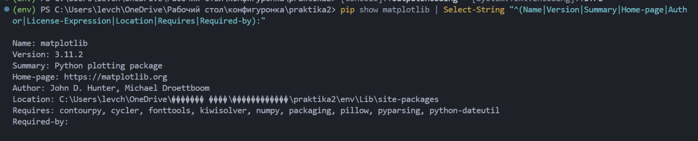
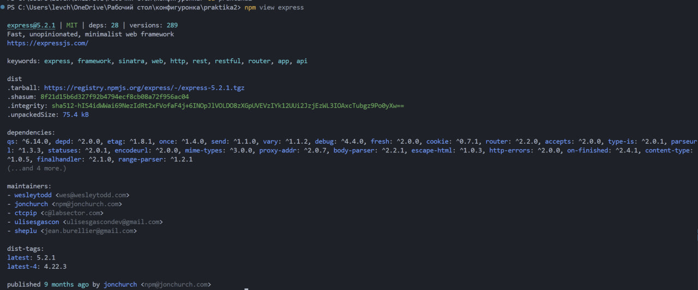
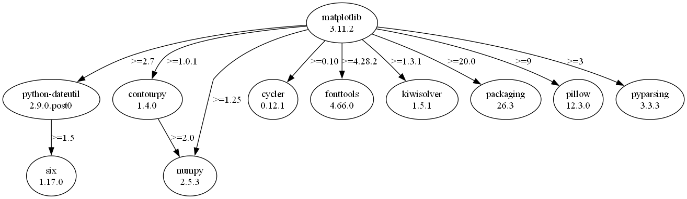
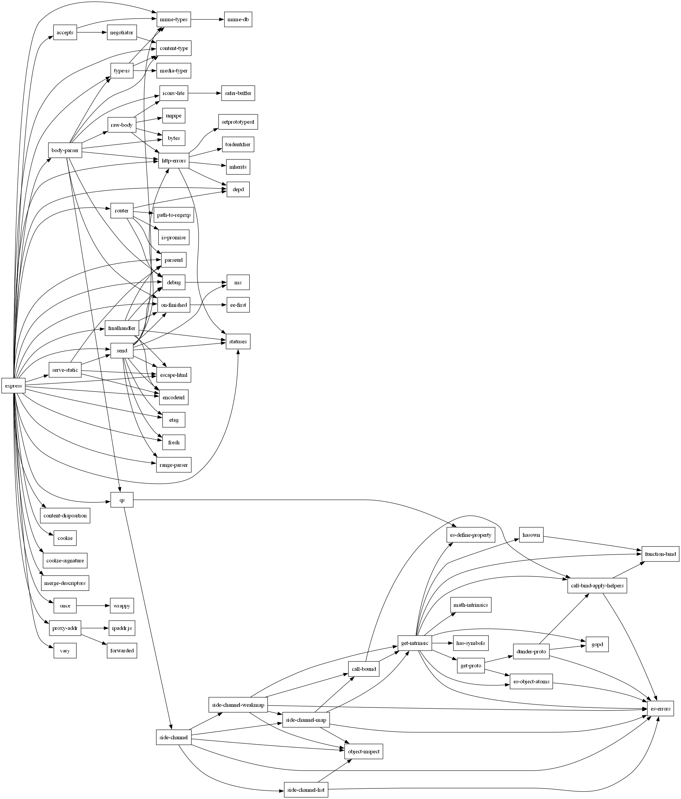
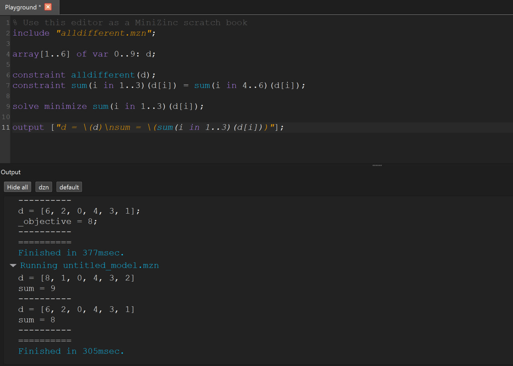
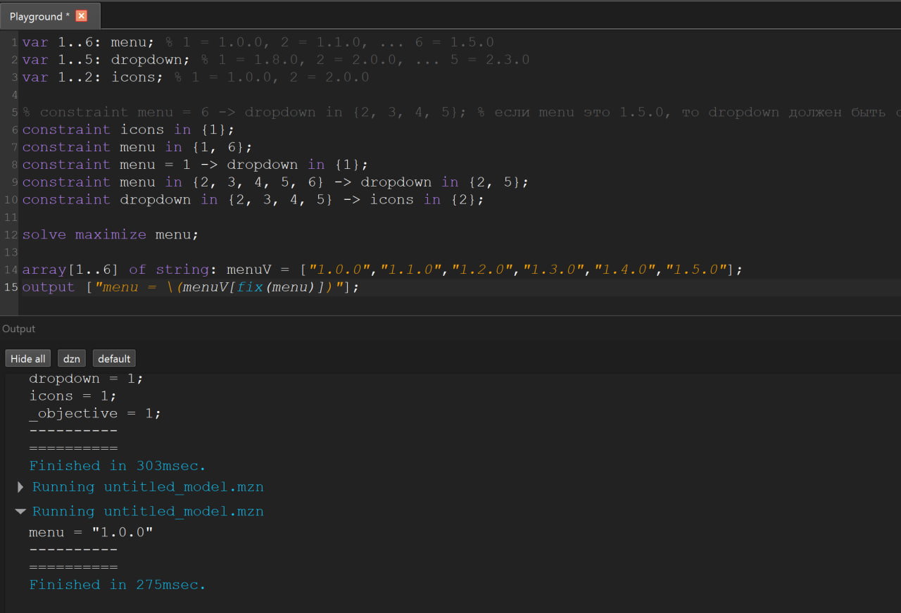
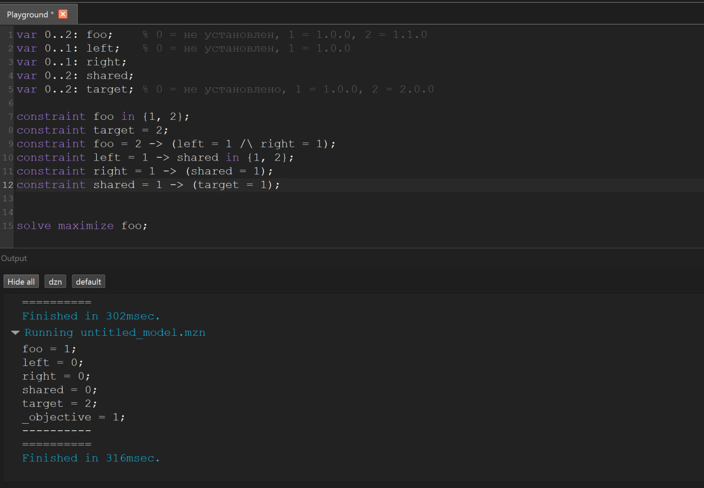
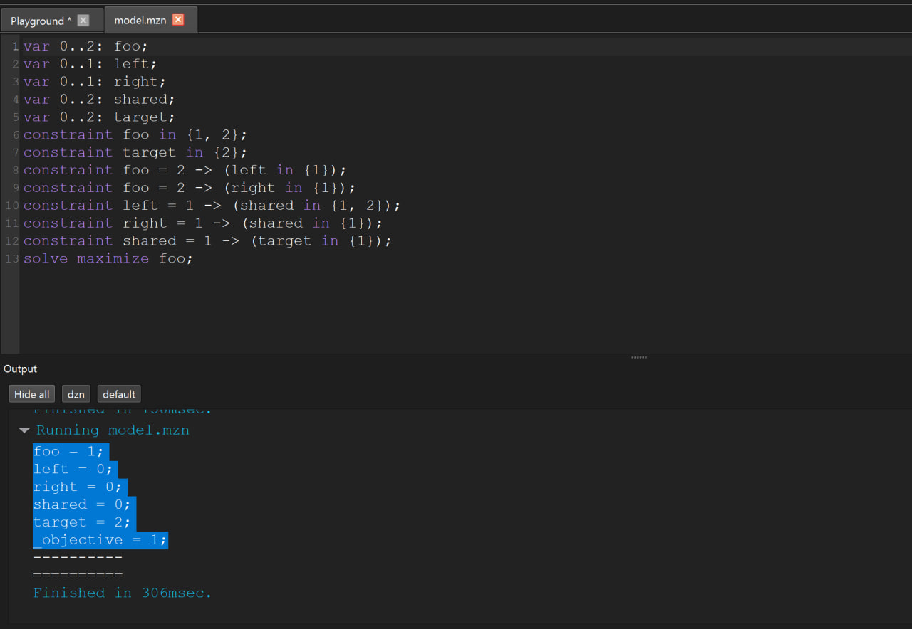

# Практическое занятие №2. Менеджеры пакетов

## Общие понятия

- **Менеджер пакетов** — программа, которая скачивает пакеты из репозитория, ставит их вместе с зависимостями и следит за совместимостью версий.
- **Пакет** — архив с кодом плюс файл со служебной информацией (метаданными): имя, версия, автор, лицензия, список зависимостей.
- **semver** (`МАЖОРНАЯ.МИНОРНАЯ.ПАТЧ`): мажорная меняется при несовместимых изменениях, минорная при добавлении функций с сохранением совместимости, патч при исправлениях.
  - `^1.2.3` — любая `1.x.x` не ниже `1.2.3` (мажорную менять нельзя).
  - `~1.2.3` — любая `1.2.x` не ниже `1.2.3`.
  - `>=1.0.0`, `<2.0.0` — прямое сравнение версий.
- Встроенный пакетный менеджер есть у многих программ: расширения VS Code, плагины Vim (vim-plug), пакеты TeX (tlmgr), дополнения Blender, моды игр через Steam Workshop.

---

## Задача 1. Служебная информация о пакете matplotlib (Python)

Менеджер пакетов — `pip`, репозиторий — PyPI.

```powershell
pip install matplotlib
pip show matplotlib
```

```powershell
pip show matplotlib | Select-String "^(Name|Version|Summary|Home-page|Author|License-Expression|Location|Requires|Required-by):"
```



Основные поля:
- `Metadata-Version` — версия формата метаданных;
- `Name`, `Version` — имя пакета и его версия по semver;
- `Summary`, `Home-page`, `Author`, `License` — описание, сайт, автор, лицензия;
- `Requires-Python` — минимальная версия интерпретатора;
- `Requires-Dist` — зависимости **с ограничениями версий** (`pip show` в поле `Requires` показывает только имена, без ограничений).

Рядом в той же папке лежат `RECORD` (список всех файлов пакета с хешами и размерами) и `WHEEL` (сведения о формате сборки).

**Как получить пакет без менеджера пакетов:**

1. Исходный код из репозитория: `git clone https://github.com/matplotlib/matplotlib.git`. Это код в том виде, в каком его пишут разработчики: папки `dist-info` там нет, пакет нужно собирать.
2. Готовый пакет с PyPI: на странице `pypi.org/project/matplotlib` лежат файлы `.whl` (собранный пакет) и `.tar.gz` (исходники). Файл `.whl` — это обычный zip-архив: если переименовать его в `.zip` и распаковать, внутри окажется та же папка `dist-info` с `METADATA`. По сути при установке pip именно распаковывает этот архив в `site-packages`.

---

## Задача 2. Служебная информация о пакете express (JavaScript)

Менеджер пакетов — `npm`, репозиторий — registry.npmjs.org. Команда `npm view` читает метаданные прямо из реестра, без установки пакета:

```powershell
npm view express
```



Основное из вывода:
- `express@5.2.1 | MIT | deps: 28 | versions: 289` — имя, текущая версия, лицензия, число прямых зависимостей, количество опубликованных версий;
- `keywords` — ключевые слова для поиска в реестре;
- `dist` — сведения об архиве пакета: `tarball` (прямая ссылка), `shasum` и `integrity` (хеши для проверки целостности), `unpackedSize` (размер после распаковки);
- `dependencies` — зависимости с ограничениями версий;
- `maintainers` — сопровождающие;
- `dist-tags` — метки версий: `latest` ставится по умолчанию, `latest-4` указывает на последнюю версию старой ветки 4.x.

Полное содержимое `package.json` выводится командой `npm view express --json`; там видны также `engines` (требуемая версия Node.js, аналог `Requires-Python`) и `devDependencies` (зависимости только для разработки, при обычной установке не ставятся).

**Про semver в `dependencies`:** почти все ограничения записаны через `^`. Например, `qs: ^6.14.0` означает любую версию 6.x.x не ниже 6.14.0. Отдельно стоит `cookie: ^0.7.1`: для версий, начинающихся с нуля, `^` работает строже и разрешает только 0.7.x, поскольку в нулевой мажорной версии API считается нестабильным.

**Как получить пакет без менеджера пакетов:**

1. Исходный код: `git clone https://github.com/expressjs/express.git`.
2. Готовый пакет: ссылка из поля `dist.tarball`, то есть `https://registry.npmjs.org/express/-/express-5.2.1.tgz`. Внутри архива папка `package` с тем же `package.json`. Это прямой аналог `.whl` из первой задачи.

---

## Задача 3. Графы зависимостей (Graphviz)

Graphviz рисует графы по текстовому описанию на языке DOT: `digraph` — ориентированный граф, `->` — ребро «зависит от». Картинка получается командой:

```powershell
dot -Tpng matplotlib.dot -o matplotlib.png
```

### matplotlib

Дерево зависимостей установленного пакета выгружено утилитой `pipdeptree` сразу в формате DOT:

```powershell
pip install pipdeptree
pipdeptree -p matplotlib --graph-output dot > matplotlib.dot
dot -Tpng matplotlib.dot -o matplotlib.png
```



Дерево неглубокое: почти все зависимости прямые, второй уровень образуют только `six` (у `python-dateutil`) и `numpy` (у `contourpy`).

**Важное наблюдение.** На `numpy` указывают сразу два пакета с разными ограничениями: `matplotlib` требует `>=1.25`, а `contourpy` — `>=2.0`. Установить две разные версии одного пакета нельзя, поэтому менеджер обязан подобрать одну версию, удовлетворяющую обоим условиям (здесь это 2.5.3). Ровно эта задача решается в заданиях 5–7.

### express

Полное дерево установленного проекта выгружено в JSON и преобразовано в DOT скриптом на Python:

```powershell
npm init -y
npm install express
npm ls --all --json > initExpressDep.json
python main.py
dot -Tpng express.dot -o express.png
```



Граф гораздо больше: 65 уникальных пакетов и 125 рёбер. Видны два плотных кластера: сам веб-фреймворк и внутренности пакета `qs` справа.

**Повторяющиеся зависимости.** 29 пакетов из 65 имеют более одного родителя, то есть встречаются в разных ветках дерева:

- `es-errors` — 8 родителей (`get-intrinsic`, `side-channel` и его варианты, `dunder-proto` и другие);
- `debug` — 5 родителей (`express`, `body-parser`, `finalhandler`, `router`, `send`);
- `mime-types`, `content-type`, `http-errors`, `on-finished`, `encodeurl`, `escape-html`, `parseurl`, `statuses` — по 4 родителя.

Поэтому при обходе дерева нужно множество уже посещённых узлов (иначе одни и те же ветки обходятся многократно), а рёбра нужно собирать в `set`, чтобы Graphviz не рисовал дубликаты стрелок.

**Сравнение экосистем:** в npm много мелких пакетов и глубокое дерево с сильным переиспользованием, в PyPI зависимостей меньше, но они крупнее.

---

## Задача 4. Счастливые билеты (MiniZinc)

В MiniZinc описывается не алгоритм, а переменные и ограничения; решение ищет решатель. `var` — переменная, значение которой подбирает решатель; `%` — комментарий.

```minizinc
include "alldifferent.mzn";

array[1..6] of var 0..9: d;

constraint alldifferent(d);
constraint sum(i in 1..3)(d[i]) = sum(i in 4..6)(d[i]);

solve minimize sum(i in 1..3)(d[i]);

output ["d = \(d)\nsum = \(sum(i in 1..3)(d[i]))"];
```

- `array[1..6] of var 0..9: d` — шесть цифр билета (индексы в MiniZinc начинаются с 1);
- `alldifferent(d)` — все цифры различны (требует `include "alldifferent.mzn"`);
- `constraint ... = ...` — равенство сумм первой и второй троек (сравнение на равенство пишется одиночным `=`);
- `solve minimize` — искать минимум указанного выражения.



**Результат:** `d = [6, 2, 0, 4, 3, 1]`, сумма трёх цифр равна **8**. Промежуточная строка с суммой 9 — это процесс улучшения решения; `==========` в конце означает, что оптимум доказан.

---

## Задача 5. Зависимости пакетов по схеме PubGrub

Пакеты `menu`, `dropdown` и `icons`, версии пронумерованы по возрастанию.

```minizinc
var 1..6: menu;      % 1 = 1.0.0, 2 = 1.1.0, ... 6 = 1.5.0
var 1..5: dropdown;  % 1 = 1.8.0, 2 = 2.0.0, ... 5 = 2.3.0
var 1..2: icons;     % 1 = 1.0.0, 2 = 2.0.0

constraint icons in {1};
constraint menu in {1, 6};
constraint menu = 1 -> dropdown in {1};
constraint menu in {2, 3, 4, 5, 6} -> dropdown in {2, 5};
constraint dropdown in {2, 3, 4, 5} -> icons in {2};

solve maximize menu;

array[1..6] of string: menuV = ["1.0.0","1.1.0","1.2.0","1.3.0","1.4.0","1.5.0"];
output ["menu = \(menuV[fix(menu)])"];
```

- `->` — импликация «если … то …»: левая часть условие, правая следствие;
- `in {…}` — принадлежность множеству допустимых индексов;
- ограничения от `root` записаны без импликации, поскольку `root` выбран всегда;
- `fix` в `output` превращает уже найденное значение переменной в обычное число, чтобы обратиться по нему к массиву строк.



**Результат:** `menu = 1.0.0`, `dropdown = 1.8.0`, `icons = 1.0.0`.

**Разбор.** Несмотря на `maximize menu`, выбрана самая старая версия. Решатель пробует `menu 1.5.0`, но тогда требуется `dropdown 2.x`, который требует `icons 2.0.0`, тогда как `root` требует `icons 1.0.0` — противоречие. Все версии menu выше 1.0.0 отпадают по той же цепочке, и максимум среди допустимых оказывается минимумом среди всех. Настоящий менеджер пакетов в такой ситуации сообщает о понижении версии.

---

## Задача 6. Зависимости пакетов по текстовым данным

Исходные данные:

```
root 1.0.0 зависит от foo ^1.0.0 и target ^2.0.0.
foo 1.1.0 зависит от left ^1.0.0 и right ^1.0.0.
foo 1.0.0 не имеет зависимостей.
left 1.0.0 зависит от shared >=1.0.0.
right 1.0.0 зависит от shared <2.0.0.
shared 2.0.0 не имеет зависимостей.
shared 1.0.0 зависит от target ^1.0.0.
target 2.0.0 и 1.0.0 не имеют зависимостей.
```

Новое по сравнению с задачей 5: пакет может быть **не установлен вообще**, поэтому к каждой переменной добавлено значение `0`.

```minizinc
var 0..2: foo;     % 0 = не установлен, 1 = 1.0.0, 2 = 1.1.0
var 0..1: left;    % 0 = не установлен, 1 = 1.0.0
var 0..1: right;
var 0..2: shared;  % 0 = не установлен, 1 = 1.0.0, 2 = 2.0.0
var 0..2: target;  % 0 = не установлено, 1 = 1.0.0, 2 = 2.0.0

constraint foo in {1, 2};
constraint target = 2;
constraint foo = 2 -> (left = 1 /\ right = 1);
constraint left = 1 -> shared in {1, 2};
constraint right = 1 -> (shared = 1);
constraint shared = 1 -> (target = 1);

solve maximize foo;
```

- `/\` — логическое «и», `\/` — «или»;
- версии с пустым списком зависимостей (`foo 1.0.0`, `shared 2.0.0`, обе версии `target`) не дают ни одного ограничения;
- перевод ограничений semver в множества индексов: `^1.0.0` для `shared` даёт только `{1}` (мажорную версию менять нельзя), тогда как `>=1.0.0` даёт `{1, 2}`, а `<2.0.0` — снова `{1}`.



**Результат:** `foo = 1` (1.0.0), `target = 2` (2.0.0), а `left`, `right` и `shared` не установлены.

**Разбор конфликта.** `root` требует `target ^2.0.0`, то есть версию 2.0.0. Если выбрать `foo 1.1.0`, подтягиваются `left` и `right`; вместе они допускают только `shared 1.0.0` (`right` требует строго ниже 2.0.0). Но `shared 1.0.0` требует `target ^1.0.0`, что противоречит требованию root. Значит, `foo 1.1.0` невозможна, и остаётся `foo 1.0.0`, у которой зависимостей нет.

---

## Задача 7. Общая форма: генерация модели по метаданным

Зависимости описаны структурой данных (словарь `пакет → версия → {зависимость: ограничение}`), а система ограничений строится автоматически. Python порождает текст модели, MiniZinc её решает:

```
packages (словарь)  →  скрипт на Python  →  model.mzn  →  minizinc  →  решение
```

### Код генератора

```python
packages = {
    "root": {
        "1.0.0": {"foo": "^1.0.0", "target": "^2.0.0"},
    },
    "foo": {
        "1.1.0": {"left": "^1.0.0", "right": "^1.0.0"},
        "1.0.0": {},
    },
    "left": {
        "1.0.0": {"shared": ">=1.0.0"},
    },
    "right": {
        "1.0.0": {"shared": "<2.0.0"},
    },
    "shared": {
        "2.0.0": {},
        "1.0.0": {"target": "^1.0.0"},
    },
    "target": {
        "2.0.0": {},
        "1.0.0": {},
    },
}

def parse(v):
    return tuple(int(x) for x in v.split("."))

def matches(v: str, spec: str) -> bool:
    vc = parse(v)
    if spec.startswith("^"):
        vspec = parse(spec[1:])
        return vc[0] == vspec[0] and vc >= vspec
    elif spec.startswith(">="):
        return vc >= parse(spec[2:])
    elif spec.startswith("<="):
        return vc <= parse(spec[2:])
    elif spec.startswith(">"):
        return vc > parse(spec[1:])
    elif spec.startswith("<"):
        return vc < parse(spec[1:])
    else:
        return vc == parse(spec)

def main():
    lines = []
    versions = dict()
    for package, v in packages.items():
        if not versions.get(package):
            keys = list(v.keys())
            versions[package] = sorted(keys, key=parse)
    for pckg, v in versions.items():
        if pckg != "root":
            lines.append(f"var 0..{len(v)}: {pckg};")

    root = versions.get("root", "")
    if root:
        rootP = packages.get("root").get("1.0.0")
        for name, v in rootP.items():
            idx = [0 for _ in range(len(versions.get(name))+1)]
            for i, vers in enumerate(versions.get(name)):
                if matches(vers, v):
                    idx[i+1] = 1
            sIDX = []
            for j in range(len(idx)):
                if idx[j] == 1:
                    sIDX.append(j)
            sIDX = ", ".join([str(i) for i in sIDX])
            lines.append(f"constraint {name} in {{{sIDX}}};")

    for pkg, vers in packages.items():
        if pkg == "root":
            continue
        for ver, deps in vers.items():
            for dep_name, spec in deps.items():
                keyIDX = versions[pkg].index(ver) + 1
                idx = [0 for _ in range(len(versions.get(dep_name))+1)]
                for i, vv in enumerate(versions.get(dep_name)):
                    if matches(vv, spec):
                        idx[i+1] = 1
                sIDX = []
                for j in range(len(idx)):
                    if idx[j] == 1:
                        sIDX.append(j)
                sIDX = ", ".join([str(i) for i in sIDX])
                lines.append(f"constraint {pkg} = {keyIDX} -> ({dep_name} in {{{sIDX}}});")

    lines.append("solve maximize foo;")
    with open("model.mzn", "w", encoding="utf-8") as f:
        f.write("\n".join(lines))

if __name__ == "__main__":
    main()
```

### Как это работает

1. **`parse`** превращает строку версии в кортеж чисел (`"1.10.0"` → `(1, 10, 0)`). Кортежи сравниваются поэлементно, поэтому `1.10.0` правильно считается новее `1.9.0`; при сравнении версий как строк это было бы не так.
2. **`matches(версия, ограничение)`** проверяет, подходит ли версия под ограничение semver. Для `^` условие двойное: совпадает мажорная часть и версия не ниже указанной. Проверки `>=` и `<=` стоят раньше `>` и `<`, иначе последние перехватили бы строки вида `>=1.0.0`.
3. **Нумерация версий.** Для каждого пакета версии сортируются по возрастанию: индекс 1 — самая старая, последний индекс — самая свежая, а 0 означает «не установлен». Отсюда строки `var 0..N: пакет;`.
4. **Ограничения root** печатаются без импликации.
5. **Ограничения остальных пакетов**: три вложенных цикла (пакет → версия → зависимость). Для каждой тройки вычисляется индекс текущей версии и множество индексов версий зависимости, для которых `matches` вернул `True`. Если у версии нет зависимостей, внутренний цикл не выполняется и ограничений не появляется.

### Сгенерированная модель и результат

Файл `model.mzn` записывается напрямую из Python с явным `encoding="utf-8"`. Перенаправление `python main.py > model.mzn` в PowerShell не подходит: файл сохраняется в UTF-16, а `Out-File -Encoding utf8` добавляет в начало BOM, и MiniZinc в обоих случаях выдаёт `syntax error: unexpected invalid token` на первом символе.



Сгенерированная модель:

```minizinc
var 0..2: foo;
var 0..1: left;
var 0..1: right;
var 0..2: shared;
var 0..2: target;
constraint foo in {1, 2};
constraint target in {2};
constraint foo = 2 -> (left in {1});
constraint foo = 2 -> (right in {1});
constraint left = 1 -> (shared in {1, 2});
constraint right = 1 -> (shared in {1});
constraint shared = 1 -> (target in {1});
solve maximize foo;
```

**Результат:** `foo = 1`, `left = 0`, `right = 0`, `shared = 0`, `target = 2`.

Модель, построенная автоматически, совпадает с написанной вручную в задаче 6 (отличается только формой записи одноэлементных множеств: `in {1}` вместо `= 1`), и решение совпадает полностью. Это подтверждает корректность генератора.

---

## Выводы

1. Пакет в любой экосистеме устроен одинаково: код плюс файл метаданных с именем, версией, лицензией и списком зависимостей с ограничениями версий (`METADATA` у Python, `package.json` у JavaScript). Получить пакет можно и без менеджера — из git-репозитория (исходники) или скачав архив из реестра (`.whl`, `.tgz`).
2. Ограничения semver — это не «версия не ниже», а интервал: `^1.0.0` запрещает переход на 2.x, поскольку смена мажорной версии означает несовместимые изменения.
3. Зависимости образуют не дерево, а граф: один пакет требуется многим (в express 29 узлов из 65 имеют более одного родителя, у matplotlib на numpy ссылаются два пакета с разными ограничениями). Поскольку установить две версии одного пакета нельзя, менеджер должен найти версию, удовлетворяющую всем требованиям сразу.
4. Выбор версий — задача удовлетворения ограничений: переменная на пакет, значение — номер версии или 0, зависимости — импликации. Стратегия «брать самое свежее» не работает: в задачах 5 и 6 максимизация привела к выбору самых старых версий, потому что новые создавали противоречие.
5. Задача 7 показывает принцип работы настоящего менеджера пакетов: система ограничений не пишется вручную, а строится автоматически по метаданным, после чего решение ищет универсальный решатель.
