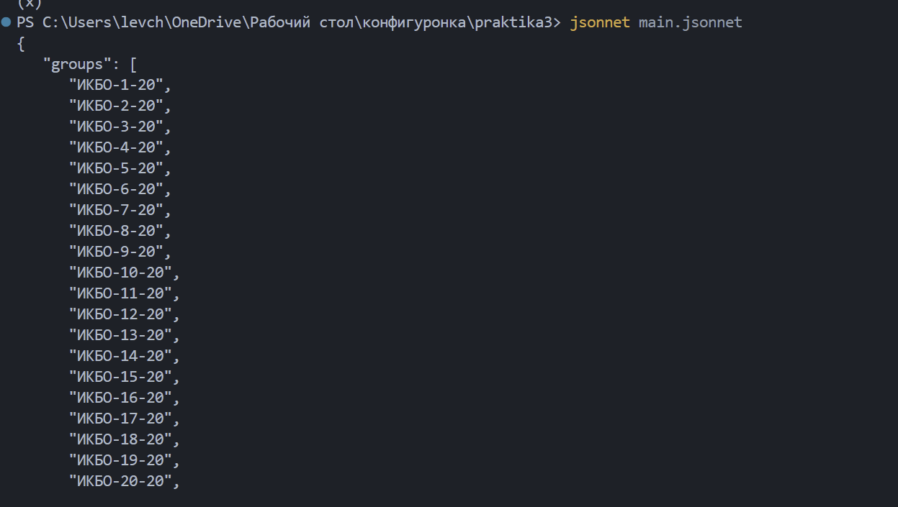
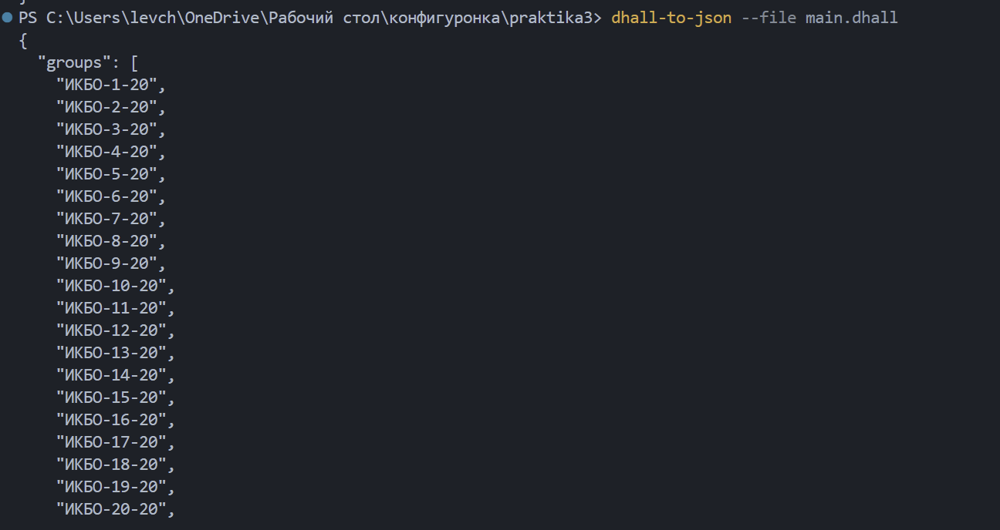
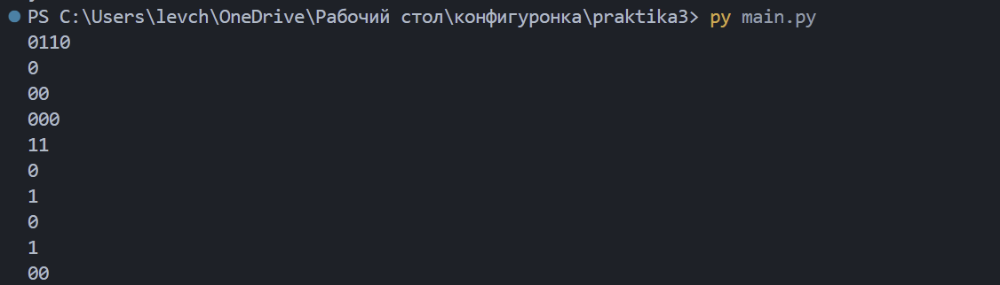
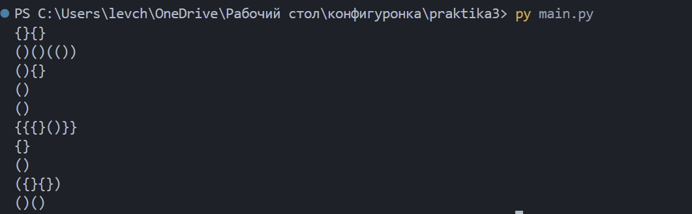
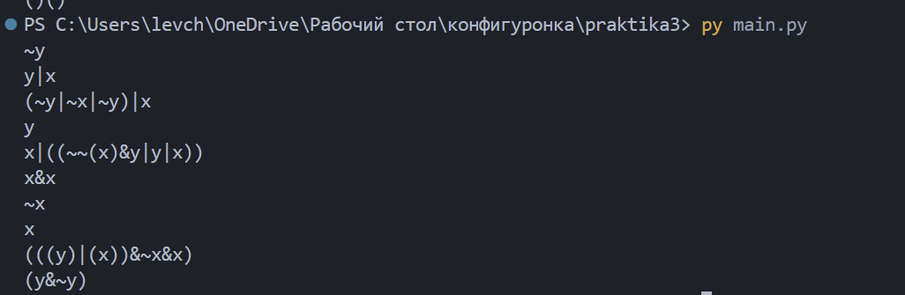

## Общие понятия

**Конфигурационный язык** описывает данные, а не алгоритм. Классический пример — JSON: он прост и читается любой программой, но у него нет переменных, функций, арифметики и даже комментариев. Как только конфигурация разрастается, появляется дублирование: в примере из задания 24 группы отличаются друг от друга одним числом, но каждую приходится выписывать вручную.

**Программируемые конфигурационные языки** решают эту проблему: конфигурация пишется как компактная программа, которая вычисляется и превращается в обычный JSON.

- **Jsonnet** — надмножество JSON: тот же синтаксис плюс переменные, функции, арифметика, генераторы списков и комментарии. Динамически типизирован.
- **Dhall** — строго типизированный функциональный язык: гарантированно завершается (нет рекурсии общего вида и циклов), типы проверяются до вычисления, есть импорт по URL.

**DRY** (Don't Repeat Yourself) — принцип, по которому каждый факт должен быть описан в одном месте. Применительно к заданию: шаблон имени группы, год и количество групп должны встречаться ровно по одному разу, чтобы изменение не приходилось вносить в десяток мест.

---

## Задача 1. Jsonnet

```jsonnet
local year = 20;
local defGroupNum = 4;
local group(n) = "ИКБО-%d-%d" % [n, year];

{
    groups: ["ИКБО-%d-%d" % [i, year] for i in std.range(1, 24)],
    students: [
        {
            "age": 19,
            "group": group(defGroupNum),
            "name" : "Иванов И.И.",
        },
        {
            "age": 18,
            "group": group(defGroupNum+1),
            "name" : "Петров П.П.",
        },
        {
            "age": 18,
            "group": group(defGroupNum+1),
            "name" : "Сидоров С.С.",
        },
        {
            "age": 20,
            "group": group(defGroupNum-1),
            "name" : "Родионов Р.Р.",
        }
    ],
    subject: "Конфигурационное управление",
}
```

**Использованные возможности языка:**

- `local имя = значение;` — локальная переменная, объявляется до объекта;
- `local group(n) = ...;` — функция одного аргумента; благодаря ей шаблон имени группы описан в одном месте;
- `std.range(1, 24)` — список чисел от 1 до 24 (обе границы включительно);
- `[выражение for i in список]` — генератор списка, как в Python;
- `"строка" % [a, b]` — форматирование в стиле printf; `%d` подставляет число (простая конкатенация `+` число со строкой не склеивает);
- арифметика прямо в выражениях: `defGroupNum+1`, `defGroupNum-1`.

**Запуск:**

```powershell
jsonnet main.jsonnet            # вывод в консоль
jsonnet main.jsonnet -o result.json
```



**Результат** (`result.json`): объект с 24 сгенерированными группами, четырьмя студентами и названием предмета. Ключи внутри объектов Jsonnet выводит отсортированными по алфавиту, поэтому порядок `age`, `group`, `name` совпадает с образцом из задания.

---

## Задача 2. Dhall

```dhall
let year = "20"
let defGroupNum = 4
let groupCount = 24

let group = \(n : Natural) -> "ИКБО-" ++ Natural/show n ++ "-" ++ year

let groups =
    Natural/fold 
      groupCount
      (List Text)
      ( \(acc : List Text) ->
            [ group (Natural/subtract (List/length Text acc) groupCount) ]
       # acc
      )
      ([]: List Text)
    
in  { subject = "Конфигурационное управление"
    , groups = groups
    , students = [ 
        { age = 19, group = group defGroupNum, name = "Иванов И.И." },
        { age = 18, group = group (defGroupNum + 1), name = "Петров П.П." },
        { age = 18, group = group (defGroupNum + 1), name = "Сидоров С.С." },
        { age = 20, group = group (Natural/subtract 1 defGroupNum), name = "Родионов Р.Р." },
        ]
    }
```

**Использованные возможности языка:**

- `let имя = значение` — привязка; последовательность `let` завершается ключевым словом `in`, после которого идёт единственное выражение-результат;
- `\(n : Natural) -> тело` — функция с явно указанным типом аргумента; вызывается через пробел (`group 4`), а не скобками;
- `++` — конкатенация текста, `#` — конкатенация списков;
- `Natural/show` — преобразование числа в текст (неявных приведений типов в Dhall нет);
- `Natural/subtract a b` — вычитание `b - a`;
- `Natural/fold n тип шаг начальное` — свёртка, повторяющая функцию `n` раз.

**Как генерируется список групп.** В Dhall нет генераторов списков, поэтому используется `Natural/fold`: 24 раза выполняется шаг, который добавляет очередную строку **в начало** накопленного списка. Номер вычисляется от текущей длины списка (`groupCount - List/length`), поэтому первой добавляется группа №24, последней — №1, а итоговый порядок получается возрастающим.

**Запуск:**

```powershell
dhall-to-json --file main.dhall --output resultDhall.json
```



**Результат** (`resultDhall.json`) совпадает с результатом Jsonnet.

### Сравнение языков

| | Jsonnet | Dhall |
|---|---|---|
| Синтаксис | надмножество JSON, привычный | функциональный, непривычный |
| Типизация | динамическая | строгая статическая |
| Генерация списка | `[... for i in std.range(1,24)]` | `Natural/fold` с явным указанием типов |
| Арифметика | `+`, `-`, `*`, `/` | `+`, `*` инфиксные; `-` только функцией |
| Диагностика ошибок | указывает точную позицию | часто указывает не на ту строку |

Jsonnet заметно удобнее для такой задачи, Dhall же даёт гарантии: он не позволит сложить число со строкой или написать незавершающуюся конфигурацию.

---

## Задачи 3–5. Грамматики БНФ

**БНФ** (форма Бэкуса–Наура) описывает синтаксис языка набором правил вида «нетерминал = альтернатива | альтернатива». Нетерминалы раскрываются по правилам, а всё, для чего правила нет, считается терминалом и попадает в строку как есть. Рекурсивные правила (нетерминал ссылается сам на себя) дают бесконечное множество строк конечным набором правил.

Данная в задании программа генерирует случайные строки языка: `parse_bnf` превращает текст в словарь, `generate_phrase` выбирает случайную альтернативу и рекурсивно раскрывает её элементы.

### Изменение в программе

В задаче 5 понадобился символ `|` как часть самого языка (дизъюнкция), но в исходном парсере он занят под разделитель альтернатив. Проверка показывает, что породить его невозможно:

```python
>>> parse_bnf("D = |")
{'D': [[], []]}
```

То есть нетерминал раскрывается в пустую строку, и дизъюнкция из выражений исчезает. Поэтому в `parse_bnf` разделитель альтернатив заменён с `|` на `/` — правка в один символ, не меняющая логику генератора:

```python
def parse_bnf(text):
    grammar = {}
    rules = [line.split('=') for line in text.strip().split('\n')]
    for name, body in rules:
        grammar[name.strip()] = [alt.split() for alt in body.split('/')]   # было: body.split('|')
    return grammar
```

После этого `|` освобождается и может использоваться как обычный терминал. Во всех трёх грамматиках альтернативы разделяются слешем.

---

## Задача 3. Язык нулей и единиц

```python
BNF = '''
E = B / B E
B = 0 / 1
'''
```

- `B` — одна двоичная цифра;
- `E` — либо одна цифра (базовый случай, завершает вывод), либо цифра, за которой снова следует `E` (рекурсия, даёт произвольную длину).

**Вывод строки `10`:** `E → B E → 1 E → 1 B → 10`.



**Наблюдение.** Строки получаются короткими: у `E` две альтернативы, и завершающая выбирается с вероятностью 1/2, поэтому средняя длина около двух символов. Если продублировать рекурсивную альтернативу (`E = B / B E / B E`), строки станут длиннее, при этом **язык не изменится**: БНФ задаёт множество допустимых строк, но ничего не говорит о вероятности их появления.

---

## Задача 4. Правильно расставленные скобки двух видов

```python
BNF2 = '''
E = B / K / B E / K E / ( E ) / { E }
B = ( )
K = { }
'''
```

- `B` и `K` — пустые пары скобок, базовые случаи;
- `B E` и `K E` — последовательность: за правильной строкой следует ещё одна;
- `( E )` и `{ E }` — вложенность: правильная строка обёрнута в скобки.

Правильность обеспечивается тем, что открывающая и закрывающая скобки порождаются **одним** правилом и всегда парны. Первоначальная попытка завести отдельные нетерминалы «любая открывающая» и «любая закрывающая» оказалась неверной: при независимом выборе получались строки вида `(}`.

**Вывод строки `{()}`:** `E → { E } → { B } → {()}`.



Эту грамматику можно записать ещё компактнее, одним нетерминалом: `E = ( ) / { } / ( E ) / { E } / E E`. Язык получается тот же.

---

## Задача 5. Выражения алгебры логики

```python
BNF3 = '''
    E = V / V / O E / E K E / E D E / ( E )
    V = x / y
    O = ~
    K = &
    D = |
'''
```

- `V` — переменная (`x` или `y`), базовый случай;
- `O E` — отрицание;
- `E K E` — конъюнкция, `E D E` — дизъюнкция;
- `( E )` — группировка скобками;
- операторы вынесены в отдельные нетерминалы `O`, `K`, `D`, поскольку в правой части правила элементы разделяются пробелами.

**Вывод строки `~x`:** `E → O E → ~ E → ~ V → ~x`.



### Ограничения формата, выявленные в этой задаче

1. **Метасимвол нельзя использовать как символ языка.** Вертикальная черта зарезервирована под разделитель альтернатив, и разбиение по ней происходит раньше любой другой обработки. В полноценных нотациях БНФ это решается заключением терминалов в кавычки (`"|"`), здесь же пришлось заменить разделитель на `/`.
2. **Генератор может не завершаться.** В первой версии грамматики завершающая альтернатива была одна (`V`) против четырёх рекурсивных, из которых две порождают сразу по два вложенных `E`. В среднем дерево вывода росло быстрее, чем затухало, и программа падала с `RecursionError`. Решение — продублировать базовую альтернативу (`E = V / V / ...`), чтобы повысить вероятность остановки. Язык при этом не меняется: БНФ описывает множество строк, но не вероятности, поэтому наивный генератор со случайным равновероятным выбором нуждается в ручной балансировке.
3. **Пробелы между элементами теряются.** `alt.split()` отбрасывает пробелы при разборе, а `''.join(...)` склеивает результат без разделителей, поэтому породить оформление `x & y` из примеров задания невозможно — генерируется `x&y`. На принадлежность строки языку это не влияет: пробелы относятся к оформлению, а не к синтаксису.

---

## Выводы

1. Чистый JSON не поддерживает повторное использование: любое совпадающее значение приходится дублировать. Программируемые конфигурационные языки устраняют это, позволяя описать конфигурацию компактной программой, вычисляемой в обычный JSON.
2. Jsonnet и Dhall решают одну задачу по-разному. Jsonnet — расширение JSON с привычным синтаксисом и генераторами списков; Dhall — строгий функциональный язык, где типы проверяются заранее, а цена за это — непривычный синтаксис, отсутствие части операторов (вычитания) и запутанная диагностика ошибок.
3. Принцип DRY в обеих реализациях выражается одинаково: повторяющийся шаблон выносится в функцию, а повторяющиеся значения (год, количество групп, базовый номер) — в переменные. Тогда изменение вносится в одном месте.
4. БНФ позволяет конечным набором правил описать бесконечный язык за счёт рекурсии. Ключ к построению грамматики — найти базовые случаи и операции, порождающие новые строки языка из уже имеющихся.
5. БНФ описывает **множество** допустимых строк, но не распределение вероятностей. Поэтому случайный генератор требует балансировки альтернатив: при избытке рекурсивных правил вывод не завершается, при избытке базовых — строки получаются вырожденно короткими.
6. Практические ограничения всегда накладывает конкретная реализация, а не сама нотация: в данном парсере нельзя породить ни вертикальную черту, ни пробел, хотя в полноценной БНФ это не проблема.
